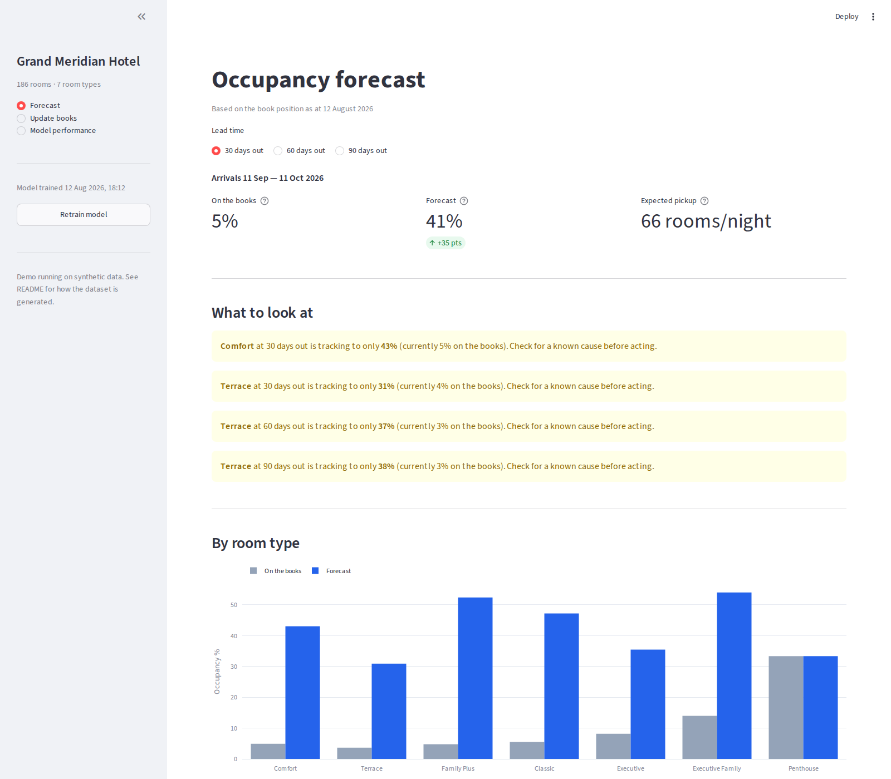

# Previsión de Ingresos Hoteleros

[](https://github.com/marrtincho/hotel-revenue-forecast/actions/workflows/ci.yml)

Previsión de la ocupación final por tipo de habitación a 30, 60 y 90 días antes
de la llegada, usando metodología de *pickup* y gradient boosting.

Los hoteles saben cuántas habitaciones tienen reservadas hoy. Lo que necesitan
saber es cuántas estarán reservadas en el momento de la llegada — la diferencia
entre esas dos cifras es el *pickup*, y predecirla bien es lo que permite a un
revenue manager fijar el precio de una fecha con tres meses de antelación con
confianza.

Este proyecto construye esa previsión de punta a punta: entran exportaciones en
bruto del PMS (property management system), salen previsiones de ocupación por
tipo de habitación, con una interfaz en Streamlit para las personas que
realmente toman las decisiones de precio.



---

## Por qué no es un problema de regresión sencillo

**El objetivo se mueve bajo tus pies.** La ocupación final de una fecha depende
de reservas que todavía no han ocurrido. Entrenar con resultados históricos
implica reconstruir cómo estaba el libro de reservas en cada lead time — un
problema de instantáneas (*snapshots*), no de una fila por observación.

**Los splits aleatorios filtran el futuro.** El comportamiento de reserva está
fuertemente autocorrelado entre fechas. Un split aleatorio train/test permite
que el modelo vea septiembre mientras predice agosto, lo que infla todas las
métricas y no dice nada sobre el rendimiento futuro real. Toda la validación
aquí es temporal.

**Los tipos de habitación pequeños son sobre todo ruido.** Un tipo con 98
habitaciones tiene suficiente variación nocturna para aprender de ella. Uno con
2 habitaciones no. Aplicar un mismo modelo de forma uniforme a todos los tipos
produce resultados que parecen seguros pero son ruido en los tipos pequeños.

**El baseline obvio es fuerte.** "Suma el pickup mediano de este tipo de
habitación y mes" es más o menos lo que hace mentalmente un revenue manager con
experiencia, y es difícil de superar. Cualquier modelo que no lo supere no vale
la pena desplegarlo.

---

## Resultados

Año de validación (*held-out*), nunca visto durante el entrenamiento. El error
es el error absoluto medio en habitaciones por noche — la unidad sobre la que
un revenue manager puede actuar.

| Lead time | Modelo | Sin más reservas | Pickup mediano | Mejora |
|-----------|--------|-------------------|-----------------|--------|
| 30 días   | 6.1    | 30.3               | 7.8             | **22.0%** |
| 60 días   | 8.2    | 38.9               | 9.9             | **16.9%** |
| 90 días   | 8.9    | 43.9               | 10.8            | **17.2%** |

*Ponderado por capacidad entre tipos de habitación. Se excluye el tipo de una
sola habitación — con capacidad de uno, cualquier error es el 100% de la
capacidad y distorsiona cualquier media.*

La versión honesta de esta tabla: el modelo gana con claridad en los tipos de
habitación de alto volumen y **está a la par del baseline en los de bajo
volumen**. Esos tipos están configurados para usar el baseline en producción en
lugar de aparentar que el modelo aporta algo. Los resultados por tipo están en
`data/output/evaluation_results.csv` y en la página de rendimiento de la app.

---

## Dos bugs que merece la pena documentar

Ambos se encontraron interrogando el comportamiento del modelo, no mirando
métricas agregadas, que es precisamente el motivo de incluirlos aquí.

### El modelo dejó de escuchar a la demanda

Las previsiones volvían casi siempre entre el 90–100% de ocupación,
independientemente de la fecha o de la posición actual del libro de reservas.
El error agregado parecía aceptable, así que nada lo detectó.

El diagnóstico fue una prueba de sensibilidad controlada: fijar todas las
variables, barrer el "en libro" (*on-the-books*) de vacío a lleno, y observar
la predicción. Un modelo que funciona bien debería subir de forma monótona.
Este daba bandazos — 83%, luego 112%, luego 94%, luego 96%.

La causa era entrenar a un número fijo de 1000 árboles sin *early stopping*. El
modelo había sobreajustado apoyándose en variables de calendario y había dejado
de usar efectivamente las reservas actuales. Tres cambios lo arreglaron:

- **Early stopping temporal** contra un tramo reciente reservado (*held-out*)
  por tipo de habitación
- **Restricciones monótonas** en las variables de demanda, de forma que más
  habitaciones en el libro nunca puedan reducir la previsión — codificando una
  regla de negocio que el modelo era libre de violar
- **Eliminar variables derivadas colineales** (ingresos OTB, porcentaje de
  ocupación OTB) que diluían la señal del número de habitaciones sin aportar
  información

Tras el arreglo, el barrido es estrictamente monótono: 57% → 74% → 78% → ... →
88%.

### Dos copias del código de entrenamiento

La herramienta de línea de comandos y la app tenían cada una su propia copia de
la lógica de entrenamiento. Una tenía early stopping; la otra no. Las métricas
se medían contra la copia buena mientras la app servía la mala.

Ahora todo el modelado vive en `forecast_engine.py` y ambas interfaces lo
importan. El arreglo estructural importa más que el bug concreto — la lógica
duplicada acaba divergiendo tarde o temprano.

---

## Enfoque

**Objetivo.** Habitaciones-noche absolutas, no porcentaje de ocupación. Ambas
son informacionalmente equivalentes frente a un denominador fijo, pero los
conteos mantienen la métrica de error interpretable y evitan comportamientos
patológicos en tipos de habitación pequeños.

**Variables.** Posición actual del libro en el lead time correspondiente;
demanda del mismo periodo del año anterior tanto a 364 días (mismo día de la
semana) como a 365 días (misma fecha de calendario); ratios de ritmo (*pace*)
que comparan la posición del libro este año frente al mismo punto el año
anterior; estructura de calendario; y un calendario de eventos locales con
pesos de impacto ordinales.

**Modelo.** LightGBM por tipo de habitación y horizonte, con restricciones
monótonas en las variables de demanda y early stopping contra un conjunto de
validación temporal.

**Cancelaciones y no-shows** se gestionan de forma implícita, no como un
modelo separado. El objetivo es la demanda realizada — ya neta de todo lo que
cayó por el camino — así que el modelo aprende directamente la conversión
histórica de reservas a llegadas. Modelarlos de forma explícita es una
extensión razonable, pero no fue necesaria para la precisión.

---

## Cómo ejecutarlo

```bash
git clone https://github.com/marrtincho/hotel-revenue-forecast.git
cd hotel-revenue-forecast

python -m venv .venv && source .venv/bin/activate
pip install -r requirements.txt

python src/data/generate_synthetic_data.py   # genera el dataset
python src/models/train_models.py            # entrena y evalúa
python src/models/predict.py                 # previsión a partir del export de ejemplo

streamlit run src/app/app.py                 # interfaz interactiva
```

Todo funciona sobre datos generados — sin credenciales, sin servicios externos.

---

## Una nota sobre los datos

Este proyecto se construyó sobre un extracto real del PMS de un hotel. Esos
datos no pueden publicarse, y el establecimiento no está identificado.

Por eso el repositorio incluye un **generador de datos sintéticos** que
reproduce el comportamiento estadístico para el que se diseñó el pipeline:
estacionalidad mensual y por día de la semana, curvas de reserva por lead time,
tasas de cancelación y no-show, picos de demanda impulsados por eventos, y
cambios de régimen interanuales. El establecimiento descrito en
`config/config.yaml` — su nombre, ubicación, mezcla de habitaciones y
calendario de eventos — es ficticio.

El generador no es una tapadera sobre un repo vacío. Codifica un modelo
concreto de cómo se comporta la demanda hotelera, y ese modelo merece la pena
leerse por sí mismo: `src/data/generate_synthetic_data.py`.

Los resultados de este README provienen de los datos sintéticos, así que
cualquiera que clone el repo puede reproducirlos. Los hallazgos que motivaron
el diseño — incluidos los dos bugs anteriores — vinieron del despliegue real.

---

## Estructura

```
config/config.yaml          Definición del establecimiento, estrategia, hiperparámetros
src/data/                   Generador de datos sintéticos
src/models/
  forecast_engine.py        Toda la lógica de modelado — fuente única de verdad
  train_models.py           Entrenamiento y evaluación del baseline
  predict.py                Previsión por línea de comandos
src/app/app.py               Interfaz Streamlit
docs/                       Notas de metodología y de datos
```

El pipeline lee todos los valores específicos del establecimiento desde
`config/config.yaml`. Apuntarlo a otro hotel es un cambio de configuración, no
de código.

---

## Stack

Python · LightGBM · pandas · NumPy · scikit-learn · Streamlit · Plotly
